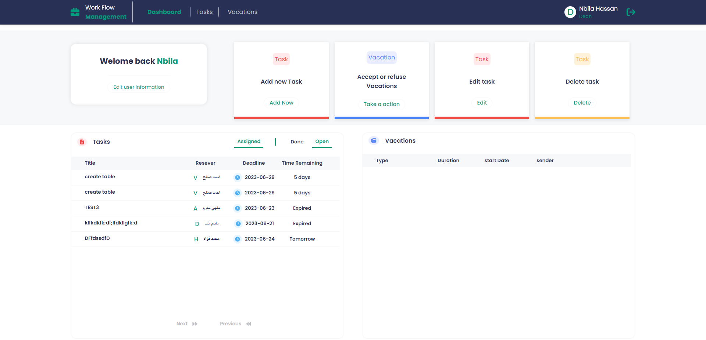
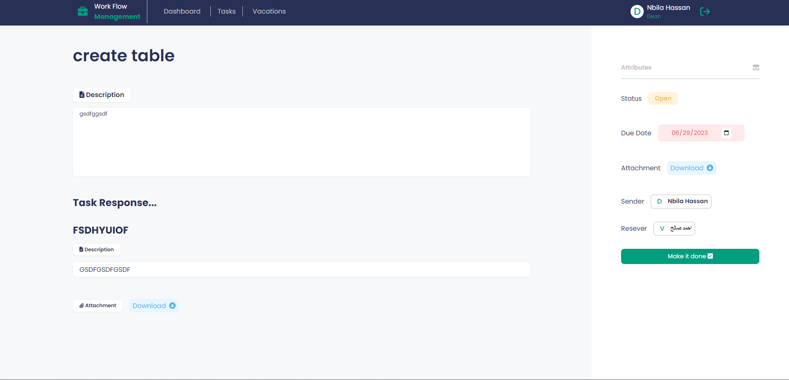

# College Workflow Management System (Front-End) 🎓

## 📌 Introduction

The College Workflow Management System (CWMS) is a web-based platform engineered to enhance communication, task delegation, progress monitoring, and feedback sharing across various faculty roles within an educational institution. By transitioning from traditional, paper-dependent systems that were prone to errors and inefficiencies, CWMS offers a digital solution to optimize workflow, foster collaboration, and elevate overall productivity.

## 🌐 Overview

This front-end part of CWMS is developed to:
- 🔗 Facilitate a hierarchy of roles: Dean, Vice Dean, Heads of Department, Doctors, and Assistant Doctors, each with distinct permissions and responsibilities.
- 💌 Provide a dedicated communication channel for the Secretary with the Dean.
- 🏝 Offer a straightforward vacation request workflow, streamlining the approval process across the user hierarchy.
- 📊 Present a user-centric dashboard for each role, highlighting tasks assigned and their progress.

## ❗ Problem Definition

The absence of a cohesive digital system in colleges has often led to workflow disruptions, miscommunication, and a lack of transparency. CWMS aims to address these challenges, transforming task management and vacation approval processes into a seamless digital experience.

## ⚠️ Challenges

The implementation of CWMS faces several challenges, including:
- 🔄 User adaptation to new digital workflows.
- 🔐 Ensuring top-tier data security and safeguarding sensitive information.
- 🔄 Seamless integration with existing institutional databases.
- 📈 Guaranteeing scalability to accommodate the growth of the institution.
- 💾 Implementing robust data backup and recovery mechanisms.
- 🛠 Providing efficient technical support and system maintenance.

## 🎯 Objectives

CWMS's core objectives encapsulate:
- 🏢 Centralizing task management processes.
- 🚀 Streamlining task allocation and tracking.
- 💬 Facilitating efficient feedback exchange among faculty.
- 📑 Supporting hierarchical management with task delegation and feedback mechanisms.
- 📣 Enhancing task visibility with real-time notifications.
- 👤 Managing user accounts effectively, with the added provision of a System Administrator role.

## 📸 Screenshot
**Dashboard**

**Task View**

## 🚀 Installation and Setup

1. Clone this front-end repository: `git clone [https://github.com/amatter23/College-Workflow-Manager]`.
2. Navigate to the project directory: `cd [frontEnd-setup]`.
3. Install required dependencies: `npm install`.
4. Start the development server: `npm start`.

## 🛠 Technologies Used

- **Framework**: React
- **Styling**: CSS, Js
- **Development Environment**: Visual Studio Code
- **Design Tool**: Figma

## 👥 Feedback & Contributions

Your feedback is invaluable in refining CWMS. We encourage contributions. Please feel free to open an issue or submit a pull request.

## 🙌 Acknowledgments

Gratitude to everyone involved in conceptualizing, designing, and developing CWMS, ensuring the project's success.

## 📞 Contact

For any queries, suggestions, or collaborative efforts, reach out at [linkedin](https://www.linkedin.com/in/ahmedmatter23/).
